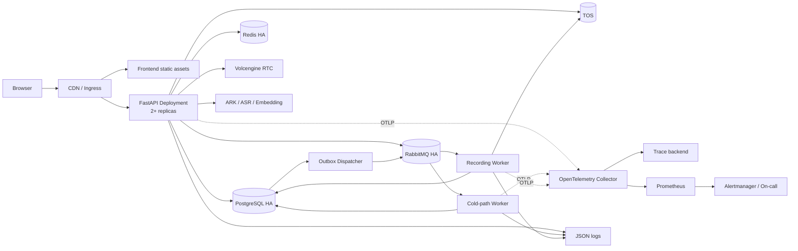
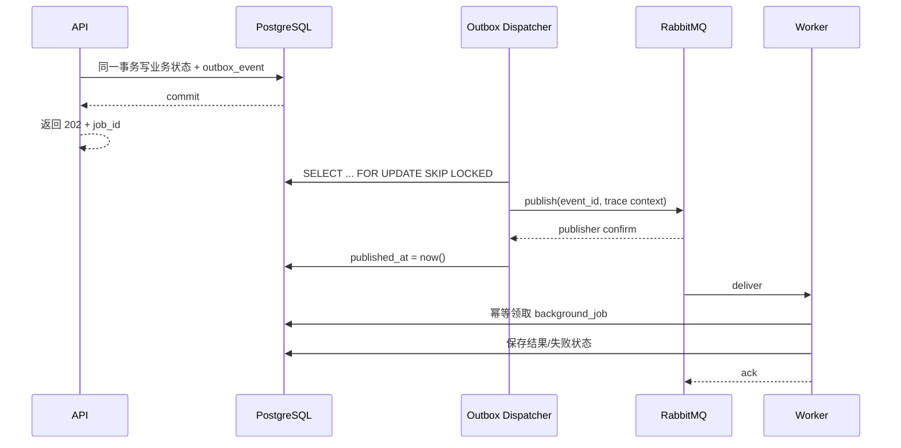

# AI 面试陪练企业级架构演进设计

> 日期：2026-08-24  
> 状态：Proposed（待架构评审）  
> 适用范围：`src/`、`rag_llm_server/`、`.github/` 与未来部署目录  
> 目标读者：后端、前端、测试、SRE、安全与发布负责人

## 1. 文档目的

本文定义 AI 面试陪练从“单进程、单 worker、SQLite”应用演进为可多副本部署、可观测、可恢复、可审计的企业级系统的目标架构和实施路径。

本设计覆盖四项工作：

1. 将 SQLite 和进程内共享状态迁移到 PostgreSQL、Redis 与持久化任务队列。
2. 建立结构化日志、Request ID、OpenTelemetry、指标、健康探针和告警。
3. 建立容器、Kubernetes 部署、数据库迁移、备份恢复、灰度发布和回滚机制。
4. 修复现有失败测试，并在 CI 中增加覆盖率、安全扫描和制品安全门禁。

本文是实施前的设计基线，不直接授权生产基础设施采购、数据库切换或 CI 权限变更。所有提议决策在评审通过后再转为 Accepted ADR 和实施任务。

## 2. 现状与问题

### 2.1 当前架构

- 前端：React 18、TypeScript、Vite、Redux Toolkit、RTC SDK。
- 后端：FastAPI、LangGraph、多个 Agent、RAG、SQLite、TOS。
- 认证：用户名密码、HttpOnly Cookie、会话摘要持久化。
- 异步处理：录音分析、评分等任务使用进程内 `asyncio.create_task` 和集合追踪。
- 并发控制：登录限流、RTC 锁、任务去重等使用进程内字典、集合或锁。
- 交付：GitHub Actions 已执行前端 lint/typecheck/test/build、后端 pytest 和 Playwright E2E。

### 2.2 已确认的阻塞项

| 编号 | 当前问题 | 生产影响 |
|---|---|---|
| P0-1 | SQLite 与 LangGraph SQLite checkpointer 绑定本地磁盘 | 无法安全支持多副本并发写入和实例漂移 |
| P0-2 | 限流、RTC 锁、冷任务、录音任务状态在进程内 | 重启丢失状态；不同副本之间不能互斥或去重 |
| P0-3 | 后台任务不是持久消息 | API 提交成功后若进程退出，任务可能永久丢失 |
| P0-4 | 无 readiness/liveness、统一指标和链路追踪 | 故障不能及时发现，无法自动摘流和定位慢点 |
| P0-5 | 无容器和部署清单 | 环境不可复制，发布和回滚依赖人工 |
| P0-6 | 数据库结构由应用启动时修改 | 迁移不可独立审批、演练和回滚 |
| P1-1 | 报告、简历等列表接口缺少统一分页 | 数据增长后出现高延迟和内存风险 |
| P1-2 | CI 没有覆盖率、安全扫描、镜像扫描与 SBOM | 缺少代码和供应链安全门禁 |
| P1-3 | 当前前端单测 89/90，有一个路由测试失败 | 当前工作区不满足“测试全绿才能发布” |
| P1-4 | 后端测试虽 272/272 通过，但有异步连接线程生命周期警告 | 可能隐藏资源未关闭和测试污染 |

## 3. 目标、非目标与约束

### 3.1 目标

- API 和 Worker 均支持至少两个副本同时运行。
- 任一 API Pod 重启不丢失会话、锁状态或已提交任务。
- 数据库迁移独立于应用启动，可审计、可预检、可回滚或可前向修复。
- 所有请求具备统一 Request ID，并能关联日志、Trace 和任务。
- 对核心链路定义 SLI/SLO、告警和运行手册。
- 发布使用不可变镜像摘要，支持灰度、自动验收和快速回滚。
- PR 在测试、覆盖率、SAST、依赖、密钥、IaC 和镜像扫描通过后方可合并。

### 3.2 非目标

- 本阶段不拆分微服务。先保持模块化单体 API + 独立 Worker，避免分布式复杂度提前扩散。
- 不替换现有 RTC、TOS、LLM、RAG 供应商能力。
- 不把 Redis 作为业务数据唯一事实来源。
- 不承诺一次迁移实现跨地域双活；先实现单地域高可用和可恢复。
- 不在第一阶段引入 Elasticsearch、Kafka 或 Service Mesh。

### 3.3 前提假设

- 生产运行平台为 Kubernetes；开发环境使用 Docker Compose。
- PostgreSQL、Redis、RabbitMQ 优先采用托管高可用服务；自建时需由平台团队承担备份、升级和故障转移。
- TOS 继续保存录音、简历原文件和报告文件。
- 允许一次经过演练的 SQLite → PostgreSQL 维护窗口；如果业务要求零停机，再采用双写方案。
- API 使用同站点 HTTPS Cookie；前后端由同一站点或受控网关暴露。

## 4. 核心架构决策

### 4.1 决策总览

| 决策 | 选择 | 理由 | 主要代价 |
|---|---|---|---|
| 主数据库 | PostgreSQL | 事务、并发、索引、连接池和托管高可用成熟 | 运维和迁移成本增加 |
| Python 数据访问 | SQLAlchemy Async + psycopg + Alembic | 异步 FastAPI 适配；模型、事务和迁移有统一工具链 | 需重写 SQLite Repository |
| 短期共享状态 | Redis | 适合带 TTL 的会话缓存、限流、幂等键和锁 | 必须处理过期、故障和一致性边界 |
| 持久任务 | Celery + RabbitMQ | 成熟路由、确认、重试和 Worker 生态；队列与缓存职责分离 | 新增 broker 与 Worker 运维 |
| 任务结果 | PostgreSQL `background_job` 表 | 任务状态可查询、审计和恢复 | 需要幂等状态机 |
| 一致性投递 | Transactional Outbox | 消除“数据库提交成功但消息未发出”窗口 | 增加 dispatcher |
| 可观测性 | JSON Log + OpenTelemetry + Prometheus | 日志、Trace、Metrics 可关联 | 需控制标签基数和采样成本 |
| 部署 | Docker + Helm + Kubernetes Deployment/Job | 环境一致、滚动升级、探针和回滚标准化 | 需要平台能力 |
| 供应链 | CodeQL + Dependabot + Trivy + SBOM/Attestation | 覆盖源码、依赖、密钥、IaC 和镜像 | 增加 CI 时间和告警治理 |

### 4.2 备选方案与取舍

#### Redis 同时作为 Celery Broker

- 优点：组件更少，开发环境简单。
- 缺点：缓存、锁和任务争用同一资源；错误驱逐策略可能影响队列；故障域耦合。
- 结论：只允许本地开发使用。生产默认 RabbitMQ；若平台已有可靠云队列，可实现 Celery transport 或任务适配层替代。

#### 直接从模块化单体拆成微服务

- 优点：团队和部署边界更独立。
- 缺点：当前主要瓶颈是共享状态、交付与可观测性，不是代码仓库规模；立即拆分会增加网络、契约和分布式事务成本。
- 结论：拒绝。先拆运行角色，不拆业务服务：`web`、`worker-realtime-cold`、`worker-recording`、`outbox-dispatcher`。

#### SQLite 与 PostgreSQL 长期双写

- 优点：可持续比对，理论上接近零停机。
- 缺点：双写一致性和回滚语义复杂，SQLite 已是单实例瓶颈。
- 结论：默认采用维护窗口一次性切换；只有明确零停机要求时才启用临时双写。

## 5. 目标总体架构



### 5.1 运行角色

| 角色 | 职责 | 是否可水平扩展 |
|---|---|---|
| Frontend | 静态资源和浏览器交互 | 是，CDN 缓存 |
| API | 鉴权、业务 API、RTC 回调、SSE 热路径 | 是，无本地业务状态 |
| Cold Worker | Planner/Evaluator/Reporter 等非实时任务 | 是，按队列扩容 |
| Recording Worker | ASR 轮询、录音分析、报告生成 | 是，独立并发和超时策略 |
| Outbox Dispatcher | 扫描未发布事件并投递 RabbitMQ | 是，使用行锁避免重复发布 |
| Migration Job | 发布前执行 Alembic migration | 否，同一版本仅运行一次 |

实时 Interviewer SSE/RTC 回调仍由 API 同步处理，避免为了“全异步化”而增加实时对话延迟；Evaluator、Reporter、录音分析等冷路径进入队列。

## 6. PostgreSQL 与数据迁移设计

### 6.1 数据访问层

保留现有 `BaseStorage` 业务接口，但新增 PostgreSQL 实现并逐步把宽泛的 `dict` 边界改为明确 DTO：

```text
rag_llm_server/
├── db/
│   ├── engine.py             # AsyncEngine、pool、session factory
│   ├── models.py             # SQLAlchemy declarative models
│   └── migrations/           # Alembic revisions
├── services/storage/
│   ├── base.py               # 业务 Repository contract
│   ├── postgres.py           # PostgreSQL 实现
│   └── sqlite.py             # 迁移期只读/兼容，完成后删除
└── scripts/
    ├── migrate_sqlite_to_postgres.py
    └── verify_data_migration.py
```

约束：

- 每个请求或任务使用独立 `AsyncSession`，禁止跨 event loop 共享 Session。
- 事务由 Service 层明确开启；Repository 不在每个方法内部隐式提交。
- 所有业务表保留 `user_id`，并建立复合索引和外键。
- 列表接口统一采用游标分页；默认 20，最大 100。
- 时间统一存 UTC `timestamptz`，API 输出 ISO 8601。
- JSON 字段使用 `jsonb`，但稳定查询字段必须拆成普通列并建立索引。
- 连接池总量必须按 `API 副本 × 每副本池 + Worker 池` 计算，不得超过数据库连接预算。

### 6.2 目标表补充

除现有用户、会话、简历、消息、报告、录音表外，新增：

```text
background_job
  id uuid primary key
  job_type varchar
  aggregate_id varchar nullable
  user_id uuid nullable
  idempotency_key varchar unique
  status varchar              # pending/running/succeeded/failed/cancelled
  attempt int
  payload jsonb
  result jsonb nullable
  error_code varchar nullable
  error_message varchar nullable
  trace_id varchar nullable
  created_at/started_at/finished_at timestamptz

outbox_event
  id uuid primary key
  topic varchar
  aggregate_type varchar
  aggregate_id varchar
  payload jsonb
  trace_context jsonb
  created_at timestamptz
  published_at timestamptz nullable
  attempt int default 0
  last_error varchar nullable
```

### 6.3 LangGraph Checkpointer

- 用 PostgreSQL checkpointer 或实现与现有图状态接口兼容的 PostgreSQL adapter。
- `thread_id` 必须由 `user_id + session_id` 派生或附带归属校验，禁止仅凭客户端 session ID 读取图状态。
- 图状态写入与业务 session 状态更新需定义一致性边界：优先同一 PostgreSQL 事务；如果库组件不允许共享事务，则使用版本号和补偿任务校验。
- 保留状态版本字段，Worker 只更新期望版本，冲突时重读并重试，防止不同副本覆盖。

### 6.4 Text-to-SQL 迁移

现有 SQLite MCP 不能直接把连接串替换为 PostgreSQL 后继续使用。目标设计：

- 创建独立只读数据库角色，只能访问 Analytics 专用视图。
- 视图必须显式包含租户过滤条件；调用时通过服务端绑定的 `user_id` 参数或受控数据库上下文传入。
- SQL Guard 改为 PostgreSQL 方言解析，仍禁止 DDL/DML、多语句、系统表和任意函数。
- 服务端强制 statement timeout、返回行数上限和字段白名单。
- LLM 生成 SQL 永不使用主库写权限账号。

### 6.5 SQLite → PostgreSQL 切换步骤

默认采用可控维护窗口，避免长期双写：

1. **建模**：将当前 `_SCHEMA` 转成首个 Alembic revision；在空 PostgreSQL 执行 upgrade/downgrade 演练。
2. **转换工具**：逐表读取 SQLite，标准化 UUID、时间和 JSON，批量写入 PostgreSQL。
3. **校验工具**：比较逐表数量、主键集合、外键、`user_id` 非空、关键 JSON 可解析性和抽样内容哈希。
4. **预演**：用生产脱敏副本至少执行两次全流程，记录耗时和异常数据。
5. **冻结写入**：API 进入维护模式，拒绝新面试和上传；等待在途任务完成或安全终止。
6. **最终导出**：备份 SQLite 和对象清单，运行转换与全量校验。
7. **切换配置**：设置 `DATABASE_URL`，执行 Alembic `upgrade head`，启动单个 canary API。
8. **冒烟验证**：登录、简历、面试、报告、录音状态、Analytics、RTC 回调均通过后放量。
9. **观察期**：SQLite 只读保留至少 7 天，不再接受写入；观察期结束后按审批归档。

回退条件：数据校验不一致、核心冒烟失败或错误率超过阈值。回退动作是停止新版本、恢复旧配置并重新开放 SQLite；切换后产生新业务写入前必须完成验证，避免双主数据分叉。

### 6.6 后续 Schema 迁移规则

- 采用 expand → migrate → contract：先加兼容字段，再回填，再切读写，最后删除旧字段。
- 发布过程中禁止同一个版本直接执行不可逆 `DROP COLUMN`。
- Alembic autogenerate 结果必须人工审查，CI 执行 `alembic check`。
- Migration Job 成功后才允许新版本 Pod 进入 readiness。
- 数据迁移与 Schema 迁移分开；大表回填由可暂停、可重试的后台任务执行。

## 7. Redis 共享状态设计

### 7.1 Redis 的职责边界

| 用途 | Key 示例 | TTL | 事实来源 |
|---|---|---:|---|
| 登录会话热缓存 | `auth:session:{digest}` | 不超过 Cookie 有效期 | PostgreSQL |
| 登录失败限流 | `rate:login:{ip}:{username_hash}` | 15 分钟 | Redis 临时状态 |
| 注册限流 | `rate:register:{ip}` | 1 小时 | Redis 临时状态 |
| RTC 会话锁 | `lock:rtc:{session_id}` | 短 TTL + 续租 | PostgreSQL session |
| 任务幂等 | `idem:job:{idempotency_key}` | 任务最长保留期 | PostgreSQL job |
| 短期缓存 | `cache:resume:{user_id}:latest` | 1–5 分钟 | PostgreSQL |

Redis 不保存报告、简历、消息或任务最终结果。Redis 数据全部丢失时，系统允许性能下降或短期拒绝并发操作，但不能造成业务数据丢失。

### 7.2 Session

- Cookie 仍使用随机 opaque token，浏览器端保持 HttpOnly、Secure、SameSite。
- PostgreSQL 保存 token digest、用户、过期和撤销时间，作为审计事实来源。
- Redis 缓存 `digest → user/session metadata`；命中后仍检查 TTL，撤销时删除缓存并更新 PostgreSQL。
- 对密码修改、管理员封禁等全局撤销场景使用 `session_version`，缓存中携带版本，不逐个扫描 Key。
- Redis 故障时允许受控回源 PostgreSQL，并使用并发保护防止缓存击穿。

### 7.3 限流

- 使用 Redis Lua/Function 原子实现滑动窗口或令牌桶，不能用客户端 `GET` 后 `INCR` 的非原子组合。
- 登录维度：`IP + 归一化用户名哈希`；注册维度：IP；高成本接口额外按 user_id 限流。
- 返回统一 `429`、`Retry-After` 和限流错误码。
- 代理环境只信任由 Ingress 覆盖的真实 IP Header，禁止直接信任客户端 `X-Forwarded-For`。
- Redis 不可用时：登录/注册采用 fail-closed 或严格本地兜底；普通低风险读取可以 fail-open。策略需逐接口列出。

### 7.4 分布式锁

- 获取锁使用唯一随机 token、`SET NX PX`；释放时必须比较 token 后删除。
- 锁必须有最大 TTL，长任务需要有界续租；续租失败时任务停止写入共享资源。
- 对可能超过锁 TTL 的关键写入使用 fencing token，并在 PostgreSQL 更新条件中校验版本。
- 数据库唯一约束和幂等键仍是最终防线；Redis 锁不能替代数据库一致性约束。
- RTC 创建、报告生成和录音处理分别使用独立锁域，避免全局锁扩大故障面。

## 8. 持久化任务队列设计

### 8.1 队列划分

| 队列 | 任务 | 并发特征 | 超时 |
|---|---|---|---:|
| `interview.cold` | Planner、Evaluator、Reporter | LLM 调用，低 CPU、高外部延迟 | 按任务 2–5 分钟 |
| `recording` | ASR 提交/轮询、录音分析 | 长任务、大对象 | 最长 30 分钟 |
| `maintenance` | outbox、数据修复、缓存失效 | 短任务、可高频 | 1 分钟以内 |
| `dead-letter` | 超过最大重试次数的任务 | 人工或自动补偿 | 不自动消费 |

### 8.2 投递一致性

API 不能采用“提交数据库后直接 `send_task`”作为唯一流程，因为进程可能在两步之间退出。使用 Transactional Outbox：



### 8.3 幂等、重试与失败处理

- 每个业务动作生成稳定 `idempotency_key`，数据库建立唯一约束。
- Worker 采用 at-least-once 语义设计；重复消息必须返回已有结果或安全重算。
- 只有瞬时错误才重试：网络超时、429、可恢复 5xx；参数错误、权限错误和不支持格式不重试。
- 指数退避 + jitter；每类任务定义最大次数和总时间预算。
- Worker 只在事务成功后 ack；进程崩溃由 broker 重新投递。
- 超过最大次数进入 DLQ，并触发告警；人工重放必须记录操作者、原因和新 job_id。
- 任务 payload 不直接携带大文件或完整简历，只传对象 key 和业务 ID。
- 任务结果包含 `error_code`，对用户隐藏供应商原始错误和敏感信息。

### 8.4 Worker 隔离

- 录音任务与轻量冷任务使用不同 Deployment、队列、并发和资源限制。
- LLM/ASR/TOS 客户端设置连接、读取和总超时；重试预算不能超过任务可见性/锁 TTL。
- Worker 收到终止信号后停止领取新任务，在 `terminationGracePeriodSeconds` 内完成或安全退回未 ack 消息。

## 9. 可观测性设计

### 9.1 统一关联标识

- Ingress 若未传入合法 `X-Request-ID`，API 生成 UUID/ULID。
- 响应始终回传 `X-Request-ID`。
- 日志字段包含 `request_id`、`trace_id`、`span_id`、`user_id_hash`、`session_id`、`job_id`。
- Outbox 传播 W3C `traceparent`；Worker 消费后建立 consumer span，而不是创建完全无关的新 Trace。
- 不记录原始 Cookie、token、密码、AK/SK、完整简历、完整录音转写或 LLM Prompt。

### 9.2 结构化日志

统一 JSON 字段：

```json
{
  "timestamp": "2026-08-24T09:00:00.000Z",
  "level": "INFO",
  "service": "interview-api",
  "environment": "production",
  "version": "git-sha-or-image-digest",
  "event": "interview.started",
  "request_id": "...",
  "trace_id": "...",
  "user_id_hash": "...",
  "session_id": "...",
  "duration_ms": 42,
  "outcome": "success"
}
```

要求：

- 生产环境禁止自由文本拼接敏感对象；异常记录类型、错误码和堆栈，响应只返回通用信息。
- access log 和 application log 使用相同关联字段。
- 定义日志保留期和访问权限；包含用户标识的日志按个人信息处理。
- 审计事件单独分类：登录、登出、账号变更、管理员操作、任务重放、数据导出和迁移执行。

### 9.3 OpenTelemetry Trace

至少覆盖：

- FastAPI 入站请求和下游 HTTP 调用。
- PostgreSQL、Redis、RabbitMQ 客户端调用。
- LLM、ASR、TOS、RTC OpenAPI 调用，记录供应商、模型/端点别名、状态和耗时，不记录敏感 payload。
- LangGraph 节点、RAG 检索、报告生成和 Worker 任务。
- SSE 记录首字节时间和完整流时长，避免把每个 token 都建成 Span。

采样：错误和慢请求全采样；正常流量按环境配置比例采样。采样率是部署配置，不写死在代码中。

### 9.4 Prometheus Metrics

遵循 RED（Rate、Errors、Duration）和任务队列指标：

| 指标 | 类型 | 说明 |
|---|---|---|
| `http_server_requests_total` | Counter | method、route template、status class |
| `http_server_request_duration_seconds` | Histogram | API 延迟，不以原始 URL 作 label |
| `interview_first_token_seconds` | Histogram | 实时回答首 token 延迟 |
| `external_request_duration_seconds` | Histogram | provider、operation、outcome |
| `background_jobs_total` | Counter | job_type、outcome |
| `background_job_duration_seconds` | Histogram | 各类任务耗时 |
| `background_queue_depth` | Gauge | 队列积压 |
| `outbox_unpublished_total` | Gauge | 未投递事件数量 |
| `db_pool_in_use` | Gauge | 连接池使用量 |
| `redis_operation_errors_total` | Counter | Redis 错误 |

禁止把 user_id、session_id、request_id、文件名等高基数字段作为 Metric label。

### 9.5 健康探针

| Endpoint | 语义 | 检查项 | 失败动作 |
|---|---|---|---|
| `/health/live` | 进程是否活着 | event loop 可响应；不访问外部依赖 | Kubernetes 重启 Pod |
| `/health/ready` | 是否可接收流量 | 配置加载、迁移版本、PG；按策略检查 Redis/MQ | 从 Service 摘流，不立即重启 |
| `/health/startup` | 初始化是否完成 | Prompt、连接池和必要资源初始化 | 启动期保护，成功后停止检查 |
| `/metrics` | Prometheus 抓取 | 内网或鉴权保护 | 不对公网暴露 |

外部 LLM、ASR、RTC 不进入 liveness；供应商短暂故障不应导致所有 Pod 重启。

### 9.6 SLO 与告警

初始目标需在上线后根据真实基线校准：

| SLI | 初始目标 | 告警 |
|---|---:|---|
| API 可用性 | 月度 ≥ 99.9% | 5 分钟与 1 小时多窗口错误预算燃烧 |
| 普通 API p95 | < 500 ms（不含长任务） | 连续 10 分钟超标 |
| 实时回答首 token p95 | < 2 s | 连续 10 分钟超标 |
| 任务成功率 | ≥ 99%（排除用户输入错误） | 失败率或 DLQ 增长 |
| Outbox 投递延迟 p95 | < 10 s | 未发布数量持续增长 |
| 录音任务完成 p95 | < 20 min | 队列年龄或超时增长 |

每条告警必须链接运行手册，至少说明影响、仪表盘、排查步骤、临时缓解和升级联系人。

## 10. 容器与部署设计

### 10.1 目录规划

```text
ark_aigc_demo-main/
├── Dockerfile.frontend
├── rag_llm_server/Dockerfile
├── docker-compose.yml              # 仅本地开发
├── deploy/
│   ├── helm/interview-coach/
│   │   ├── Chart.yaml
│   │   ├── values.yaml
│   │   ├── values-staging.yaml
│   │   ├── values-production.yaml
│   │   └── templates/
│   └── runbooks/
│       ├── rollback.md
│       ├── database-restore.md
│       └── queue-backlog.md
└── .github/workflows/
    ├── ci.yml
    ├── security.yml
    └── release.yml
```

### 10.2 Docker 镜像

- 前端和后端均使用 multi-stage build。
- 基础镜像固定到明确版本；生产发布进一步固定 digest，并由自动化 PR 更新。
- 后端使用非 root 用户、最小运行时镜像、只读根文件系统和独立临时目录。
- 镜像内不复制 `.env`、测试缓存、数据库、Git 历史和开发依赖。
- 前端运行时通过同源 `/api` 访问后端，取消硬编码 `http://localhost:3001`。
- `web` 和 `worker` 使用同一后端镜像、不同 command，避免代码和依赖漂移。
- 镜像写入 OCI label：源码仓库、revision、构建时间和版本。

### 10.3 Kubernetes 资源

- `Deployment`: frontend、api、cold-worker、recording-worker、outbox-dispatcher。
- `Service/Ingress`: 只暴露 frontend/API；Redis、RabbitMQ、PostgreSQL 不暴露公网。
- `Job`: Alembic migration、一次性数据迁移和恢复演练。
- `ConfigMap/Secret`: 非敏感配置与密钥分离；生产 Secret 来自外部 Secret Manager。
- `HPA`: API 按 CPU/请求量，Worker 按队列深度和最老消息年龄扩容。
- `PodDisruptionBudget`: API 保证维护期间仍有可用副本。
- `NetworkPolicy`: API 只能访问所需依赖；Worker 不能访问不相关内部服务。
- 设置 requests/limits、securityContext、seccomp、readOnlyRootFilesystem 和禁止特权模式。
- API 至少 2 副本并跨节点/可用区调度；关键依赖采用托管 HA。

### 10.4 配置与密钥

- 统一使用 `APP_ENV`、`DATABASE_URL`、`REDIS_URL`、`CELERY_BROKER_URL`、OTLP endpoint 等环境配置。
- 启动时对生产必需项 fail fast；不得对非法布尔值或错误 URL 静默回落。
- 密钥不得出现在 Helm values、镜像层、日志、Trace 或错误响应中。
- 密钥轮换要支持新旧双值短期共存；RTC Callback Secret 轮换需明确窗口。

## 11. 备份、恢复与灾难恢复

### 11.1 数据分级

| 数据 | 事实来源 | 备份策略 |
|---|---|---|
| 用户、会话、简历结构、面试、消息、报告、任务 | PostgreSQL | 托管快照 + WAL/PITR |
| 录音、简历原文件、报告文件 | TOS | 版本控制/生命周期/跨区复制按合规要求 |
| 会话缓存、限流、锁 | Redis | 非事实来源；可重建，不依赖备份恢复业务 |
| 未消费任务 | RabbitMQ | durable/quorum queue；DLQ 保留与监控 |
| 日志、指标、Trace | 可观测后端 | 按安全与成本定义保留期 |

### 11.2 初始 RPO/RTO

- PostgreSQL：RPO ≤ 5 分钟，RTO ≤ 60 分钟。
- TOS 对象：RPO 由对象成功响应保证，误删恢复按版本控制策略；RTO ≤ 4 小时。
- RabbitMQ：单节点故障不丢已确认持久消息；整集群灾难时依赖 PostgreSQL `background_job/outbox_event` 重建未完成任务。

### 11.3 恢复演练

- 每季度在隔离环境执行 PostgreSQL PITR，验证应用能启动、迁移版本正确、抽样业务数据一致。
- 每月随机抽取 TOS 对象进行读取和哈希校验。
- 每季度演练 RabbitMQ 丢失：从 `background_job` 和 outbox 重建 pending/running 任务。
- 恢复报告记录实际 RPO/RTO、缺陷、负责人和关闭日期；“有备份”但从未恢复验证视为不合格。

## 12. 灰度发布与回滚

### 12.1 发布顺序

1. CI 生成不可变镜像、SBOM、扫描报告和 provenance attestation。
2. 部署到 staging，执行迁移、单测、集成测试、E2E 和冒烟。
3. 生产执行兼容性 Alembic migration Job。
4. 发布 1 个 canary Pod，承接约 5% 流量。
5. 按 5% → 25% → 50% → 100% 放量，每阶段观察至少一个完整指标窗口。
6. 错误率、p95、首 token、队列积压、外部依赖错误和业务成功率均通过才继续。
7. 全量后保留旧 ReplicaSet 和上一镜像摘要至观察期结束。

### 12.2 自动停止条件

- 5xx 或业务失败率明显高于基线并超过阈值。
- p95、首 token 延迟或任务积压超过阈值。
- readiness 失败、Pod 重启或连接池耗尽。
- 数据校验、迁移检查或核心冒烟失败。
- 出现新的 Critical/High 安全告警。

### 12.3 应用回滚

- Helm rollback 或恢复上一镜像 digest。
- 停止新版本 Worker，再回滚 API，避免旧 API 产生新 Worker 无法理解的消息。
- 消息 payload 必须带 `schema_version`，至少保持一个发布窗口的向后兼容。
- 前端静态资源使用内容哈希和短 HTML 缓存，避免 HTML 引用已删除 chunk。

### 12.4 数据库回滚

- 生产优先前向修复，不依赖破坏性 downgrade。
- 每次发布只执行 expand 或兼容迁移；contract 删除至少延后一个稳定版本。
- 如果 migration Job 失败，应用版本不得放量。
- 若代码回滚，旧代码必须能读取 expand 后 Schema；这是迁移评审的强制项。

## 13. 测试与 CI 质量门禁

### 13.1 先修复当前测试基线

当前验证结果：

- `npm run typecheck`：通过。
- `npm run lint`：通过。
- 前端 Vitest：89/90，通过 24/25 test files；`src/App.test.tsx` 路由导航用例失败。
- 后端 pytest：272/272 通过，但存在依赖弃用和 `aiosqlite` event loop 已关闭警告。

修复原则：

1. 先独立复现 `App.test.tsx` 失败，确认产品要求是页面标题“面试历史”还是导航项“历史记录”。
2. 如果产品文案已变，更正测试期望；如果页面应有标题，则修复页面或 lazy route 渲染。禁止仅增加任意 sleep 或删除断言。
3. 对后端线程警告定位未关闭的连接/fixture，测试结束必须无 `PytestUnhandledThreadExceptionWarning`。
4. 基线全绿后再启用强制覆盖率，避免把已知红灯固化为常态。

### 13.2 测试分层

| 层级 | 内容 | 环境 |
|---|---|---|
| Unit | 领域函数、codec、限流算法、幂等状态机、SQL Guard | 无外部服务 |
| Component | React 页面、FastAPI router/service、Worker task | Mock 外部供应商 |
| Integration | PostgreSQL、Redis、RabbitMQ、Alembic、outbox | Testcontainers/CI service containers |
| Contract | RTC/TOS/LLM adapter 请求响应 Schema | 录制样本或供应商沙箱 |
| E2E | 登录→简历→面试→报告；录音→任务→报告 | staging-like 环境 |
| Resilience | Worker kill、重复投递、Redis/MQ 短断、PG failover | 非 PR 定时流水线 |
| Restore | PostgreSQL PITR、TOS 抽样恢复、任务重建 | 定期演练环境 |

### 13.3 覆盖率策略

避免一次设置不现实阈值导致团队绕过门禁，采用两阶段：

- 第一步：记录现有覆盖率并禁止下降；新改代码行覆盖率 ≥ 90%。
- 第二步：全局目标前端 statements/lines/functions ≥ 80%、branches ≥ 75%；后端总覆盖率 ≥ 80%。
- 认证、租户隔离、SQL Guard、任务幂等、迁移校验等高风险模块分支覆盖率 ≥ 90%。
- 生成代码、纯类型声明和第三方 vendor 不计入覆盖率，但排除清单需评审。

建议命令：

```bash
npm run typecheck
npm run lint
npm test -- --coverage
npm run build
npm run e2e

cd rag_llm_server
uv run pytest --cov=. --cov-report=term-missing --cov-report=xml --cov-fail-under=80
uv run alembic check
```

### 13.4 CI 流水线

```mermaid
flowchart LR
    PR[Pull Request] --> FAST[Format/Lint/Typecheck]
    FAST --> TEST[Unit + Component + Coverage]
    TEST --> INT[PG/Redis/RabbitMQ Integration]
    INT --> SAST[CodeQL + Secret + Dependency]
    SAST --> BUILD[Build images]
    BUILD --> IMG[Trivy image/IaC + SBOM]
    IMG --> E2E[E2E / Smoke]
    E2E --> ATTEST[Sign/Attest by digest]
    ATTEST --> READY[Merge/Release eligible]
```



### 13.5 安全门禁

| 检查 | 工具/机制 | 阻断规则 |
|---|---|---|
| SAST | GitHub CodeQL：Python、JavaScript/TypeScript | 新增 High/Critical 阻断 |
| 依赖 | Dependabot + PR dependency review | 有修复版本的 High/Critical 阻断 |
| npm 依赖 | `npm audit --audit-level=high`，锁文件安装 | High/Critical 阻断，例外需到期日 |
| Python 依赖 | 锁文件漏洞扫描 | High/Critical 阻断，例外需到期日 |
| 密钥 | GitHub secret scanning/push protection + Trivy | 任何真实密钥阻断 |
| IaC | Trivy misconfiguration | High/Critical 阻断 |
| 镜像 | Trivy vuln/secret/misconfig/license | 有修复版本的 High/Critical 阻断 |
| SBOM | CycloneDX 或 SPDX | 每个发布镜像必须生成并归档 |
| Provenance | GitHub artifact attestation | 发布制品必须能按 digest 验证 |

所有 GitHub Actions 第三方 action 最终应固定到完整 commit SHA；升级由受控自动化 PR 完成。

### 13.6 分支与环境保护

- `main/master` 禁止直接 push，要求 PR、至少一名 reviewer 和全部 required checks。
- 生产 Environment 要求审批，CI 只获取目标环境的最小权限短期凭证。
- PR 工作流默认 `contents: read`，只有发布 job 获得 packages/attestations 写权限。
- Fork PR 不接触生产 Secret。
- 安全例外必须记录风险、负责人、补偿措施和到期日，禁止永久忽略。

## 14. 性能与容量设计

- API 所有列表使用分页，禁止无界 `fetchall()`。
- 200 MB 录音不在 API/Worker 间传递；API 流式上传 TOS，任务只传对象 key。
- 外部调用设置 connect/read/total timeout、有限重试和并发隔离。
- Worker 并发按供应商配额和数据库连接预算设置，不按 CPU 数盲目放大。
- LLM/ASR 使用单独 semaphore/队列和熔断策略，避免供应商故障耗尽 API 连接。
- 定义压测场景：登录、报告读取、RTC 回调、并发面试、录音上传、任务积压恢复。
- 上线前至少证明：两个 API Pod 并发运行无状态冲突，杀死任一 Pod 不丢任务。

## 15. 安全与合规补充

- 在 Ingress 强制 HTTPS、HSTS，并设置合理请求体上限和超时。
- Cookie 生产环境必须 `Secure`；保留 SameSite，并评审 CSRF token 是否需要作为纵深防御。
- 开放注册需补充邮箱/手机号验证、密码找回、账号删除和管理员审计能力，或关闭公网开放注册。
- `role` 字段必须形成实际授权策略；未实现 RBAC 前不得暴露管理员接口。
- PostgreSQL 业务账号、migration 账号和 Analytics 只读账号分离。
- 上传校验扩展到 MIME、magic bytes、解压炸弹/恶意 PDF 风险和病毒扫描；原文件隔离存储。
- 用户数据导出、删除、保留期和日志脱敏需要产品/法务确认。

## 16. 实施阶段与依赖关系

详细执行入口：[企业级架构演进任务索引](enterprise-evolution/README.md)。任务文档已锁定为“火山引擎 ECS 过渡上线 → VKE 企业级部署”，阶段状态、证据和提交号以任务文档为准。

### [Phase 0：恢复绿色基线（1 个迭代）](enterprise-evolution/phase-0-恢复绿色基线.md)

- 修复前端失败测试和后端资源警告。
- 生成覆盖率基线。
- 增加 Request ID 和 JSON 日志基础，不改变业务流程。
- 验收：所有现有测试、build、E2E 全绿；测试运行无未处理线程异常。

### [Phase 1：PostgreSQL 与迁移工具（2–3 个迭代）](enterprise-evolution/phase-1-PostgreSQL与数据迁移.md)

- 引入 SQLAlchemy Async、Alembic、PostgreSQL Repository。
- 增加分页和 PostgreSQL Text-to-SQL 安全适配。
- 完成 SQLite 转换、校验、回退脚本和两次演练。
- 验收：Repository contract tests 同时验证 SQLite/PostgreSQL；脱敏数据迁移 100% 校验通过。

### [Phase 2：Redis 与无状态 API（1–2 个迭代）](enterprise-evolution/phase-2-Redis与无状态API.md)

- 迁移会话缓存、限流、RTC 锁和幂等键。
- API 支持两个副本并发；故障策略和 TTL 测试完成。
- 验收：随机终止一个 API Pod，登录态可恢复且同一 RTC session 不重复启动。

### [Phase 3：持久任务与 Outbox（2–3 个迭代）](enterprise-evolution/phase-3-持久化任务队列与Outbox.md)

- 引入 RabbitMQ、Celery、background_job、outbox_event。
- 迁移冷任务和录音任务，建立 DLQ、重试和重放审计。
- 验收：在提交、投递、执行各阶段 kill 进程，任务最终成功或明确进入 DLQ，不静默丢失。

### [Phase 4：完整可观测性（1–2 个迭代）](enterprise-evolution/phase-4-可观测性体系.md)

- OpenTelemetry、Prometheus、Dashboard、SLO、告警和 Runbook。
- 验收：从告警能跳转到 Dashboard，并按 trace_id 定位 API→MQ→Worker→外部依赖。

### [Phase 5：火山引擎 ECS、VKE 与发布（分两步实施）](enterprise-evolution/phase-5-火山引擎部署与发布.md)

- Docker、Compose、Helm、探针、HPA/PDB/NetworkPolicy。
- 建立 staging、灰度、自动停止和回滚演练。
- 验收：新环境可由清单重建；canary 失败可在目标 RTO 内回滚。

### [Phase 6：供应链安全与灾备（1–2 个迭代）](enterprise-evolution/phase-6-供应链安全与灾备.md)

- CodeQL、Dependabot、Trivy、SBOM、attestation、分支保护。
- PostgreSQL PITR、TOS 抽样恢复、RabbitMQ 丢失重建演练。
- 验收：发布制品可验证来源；恢复演练满足 RPO/RTO。

依赖顺序：Phase 0 → Phase 1 → Phase 2 → Phase 3；Phase 4 可在 Phase 1 后与 Phase 2/3 并行；Phase 5 依赖 Phase 2/3；Phase 6 可从 Phase 0 开始逐步建设，但灾备验收依赖 Phase 1/3。

## 17. 验收标准

全部条件满足后，才可将架构状态从 Proposed 更新为 Accepted/Implemented：

- [ ] API 和 Worker 在 Kubernetes 至少两个副本稳定运行。
- [ ] API 本地磁盘不保存业务事实数据。
- [ ] SQLite 已停止写入，PostgreSQL 迁移校验通过并完成回退演练。
- [ ] 进程重启、重复消息和 broker 重投不产生重复报告或重复 RTC 任务。
- [ ] 所有后台任务可查询、可重试、可审计，失败进入 DLQ。
- [ ] 日志、Trace、Metric 可通过 request_id/trace_id/job_id 关联。
- [ ] liveness/readiness/startup 行为通过故障注入验证。
- [ ] SLO、告警、Dashboard 和 Runbook 完整并经过演练。
- [ ] 灰度发布和应用回滚在预定时间内完成。
- [ ] PostgreSQL PITR 和任务重建演练满足 RPO/RTO。
- [ ] 前后端测试、E2E、覆盖率和安全扫描全部成为 required checks。
- [ ] 发布镜像按 digest 部署，附带 SBOM 和可验证 provenance。
- [ ] 无未批准的 High/Critical 漏洞或永久安全例外。

## 18. 工程边界

### Always

- 数据库变更先写 migration 和回退/前向修复方案。
- 所有队列任务实现幂等，所有外部调用设置超时。
- 新接口必须有认证、授权、输入验证、分页和可观测性设计。
- 合并前运行相关测试、类型检查、lint 和安全扫描。
- 生产变更使用不可变镜像和经过评审的部署清单。

### Ask first

- 新增基础设施、依赖、数据库表或公共 API。
- 修改 SLO、覆盖率阈值、安全阻断规则和数据保留期。
- 执行生产 migration、任务重放、数据恢复或安全例外。
- 启用跨地域、双写或微服务拆分。

### Never

- 将密钥写入代码、镜像、Helm values、日志或 Trace。
- 依赖 Redis 作为唯一业务事实来源。
- 在生产发布同一阶段执行破坏性 Schema 删除。
- 通过删除测试、降低断言或无限增加 timeout 让 CI 变绿。
- 使用可变 `latest` 标签作为生产发布依据。
- 在未验证备份可恢复前宣称具备灾备能力。

## 19. 风险清单

| 风险 | 概率/影响 | 缓解 |
|---|---|---|
| SQLite 历史脏数据导致迁移失败 | 中/高 | 脱敏预演、逐表校验、维护窗口、只读保留 |
| 双副本出现重复 RTC 或报告任务 | 中/高 | Redis token lock + fencing + DB 幂等约束 |
| RabbitMQ/Worker 配置不当造成任务重复 | 中/高 | at-least-once 设计、acks、幂等、故障注入 |
| 指标 label 高基数导致监控成本失控 | 中/中 | route template、固定枚举；ID 只进日志/Trace |
| LLM/ASR 故障导致队列持续积压 | 高/中 | 独立队列、退避、熔断、配额、队列年龄告警 |
| Migration 与旧代码不兼容导致无法回滚 | 中/高 | expand-contract、兼容性测试、canary |
| CI 安全告警过多被团队绕过 | 中/中 | 基线治理、只阻断新增高风险、例外到期机制 |
| 引入组件过多增加运维成本 | 中/中 | 优先托管服务，保持模块化单体，不额外拆微服务 |

## 20. 待评审问题

1. 生产 Kubernetes、PostgreSQL、Redis、RabbitMQ 是否由现有平台提供托管能力？
2. 是否接受一次维护窗口完成 SQLite 切换？允许的最长窗口是多少？
3. 目标用户量、并发面试数、日录音量和数据保留期是多少？
4. 是否有等保、ISO 27001、个人信息保护或数据驻留要求？
5. 观测后端使用现有平台还是新建 Prometheus/Grafana/Trace backend？
6. GitHub 仓库是否具备 CodeQL、secret scanning、environment approval 和 artifact attestation 所需权限？
7. 初始 SLO、RPO、RTO 是否符合业务承诺？

## 21. 官方参考资料

- [SQLAlchemy PostgreSQL 与异步支持](https://docs.sqlalchemy.org/en/21/dialects/postgresql.html)
- [Alembic 数据库迁移文档](https://alembic.sqlalchemy.org/en/latest/)
- [Redis 分布式锁](https://redis.io/docs/latest/develop/clients/patterns/distributed-locks/)
- [Celery 使用 RabbitMQ](https://docs.celeryq.dev/en/stable/getting-started/backends-and-brokers/rabbitmq.html)
- [OpenTelemetry Python](https://opentelemetry.io/docs/languages/python/)
- [Prometheus Instrumentation Practices](https://prometheus.io/docs/practices/instrumentation/)
- [Kubernetes Probes](https://kubernetes.io/docs/concepts/workloads/pods/probes/)
- [Kubernetes Deployments](https://kubernetes.io/docs/concepts/workloads/controllers/deployment/)
- [PostgreSQL PITR](https://www.postgresql.org/docs/17/continuous-archiving.html)
- [Docker Build Best Practices](https://docs.docker.com/build/building/best-practices/)
- [GitHub Repository Security Quickstart](https://docs.github.com/en/code-security/getting-started/quickstart-for-securing-your-repository)
- [GitHub Artifact Attestations](https://docs.github.com/en/actions/how-tos/secure-your-work/use-artifact-attestations/use-artifact-attestations)
- [Trivy Misconfiguration Scanning](https://trivy.dev/docs/latest/scanner/misconfiguration/)
